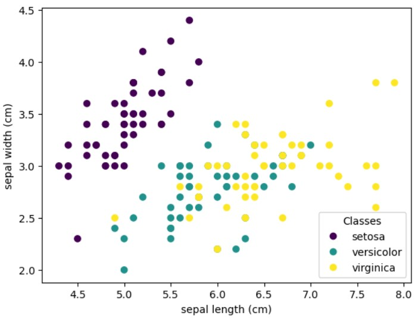
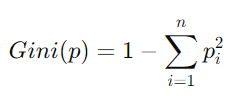
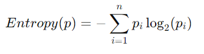
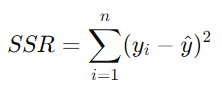

# My ML learning tracker
In this project, I practice machine learning approaches to classification task. For each approach, I implement the models from different machine learning and deep learning libraries and also, I try to reproduce the results on my own python code.
## Datasets 
### 1. Iris dataset
The iris dataset is used for experiments with classification tasks. Here is the code to load the dataset from scikit-learn library:

```python
from sklearn import datasets

iris = datasets.load_iris()
```

The features are considered in iris flowers:
- sepal length (cm)
- sepal width (cm)
- petal length (cm)
- petal width (cm)




### 2. Credit card default prediction
This a small dataset created by AI Vietnam and it is used for pratice since there are only 14 samples.

```python
import pandas as pd

# Define the attribute names
attribute_names = ['age', 'income', 'student', 'credit_rate', 'default']

# Create the data dictionary
data = {
    'age': ['youth', 'youth', 'middle_age', 'senior', 'senior', 'senior', 'middle_age', 'youth', 'youth', 'senior',
            'middle_age', 'low', 'low', 'low', 'medium', 'low', 'medium', 'medium', 'medium', 'medium'],
    'income': ['high', 'high', 'high', 'medium', 'low', 'low', 'low', 'medium', 'low', 'medium', 'medium', 'medium', 'medium', 'medium', 'medium', 'medium', 'medium', 'medium', 'medium', 'medium'],
    'student': ['no', 'no', 'no', 'no', 'yes', 'yes', 'yes', 'no', 'yes', 'yes', 'yes', 'no', 'yes', 'no', 'no', 'no', 'no', 'no', 'no', 'no'],
    'credit_rate': ['fair', 'excellent', 'fair', 'fair', 'fair', 'excellent', 'excellent', 'fair', 'fair', 'fair',
                    'fair', 'excellent', 'excellent', 'fair', 'fair', 'fair', 'excellent', 'excellent', 'fair', 'fair'],
    'default': ['no', 'no', 'yes', 'yes', 'yes', 'no', 'yes', 'no', 'yes', 'yes', 'yes', 'yes', 'yes', 'no', 'no', 'no', 'no', 'no', 'no', 'no']
}

# Create the DataFrame
df = pd.DataFrame(data, columns=attribute_names)

print(df)
```

### 3. Diabetes dataset
The diabete dataset is used for practicing with regression tasks. Here is the code for load the dataset with scikit-learn library:
```python
from sklearn.datasets import load_diabetes
diabetes = load_diabetes()
```

## 1. K Nearest Neighbors (KNN folder)
For KNN approach, the model configuration is:
- k = 5
- distance_metric='minkowski'
- algorithm_neighbors='brute'
- weight='uniform', p=2

## 2. Decision Trees
A non-parametric supervised method used for classification and regression.
### 2.1 Classification
- Using GINI and Entropy as criteria to split tree
- GINI is used to measure the impurity of a node:

- Entropy is used to measure the uncertainty of a node:


### 2.2 Regression
- Using Sum of Squared Residuals (SSR) to determine split


### 2.3 Reduce overfitting in DT
- prunning tree

### 2.4 Reference
- https://www.w3schools.com/python/python_ml_decision_tree.asp 
- https://scikit-learn.org/stable/modules/tree.html 